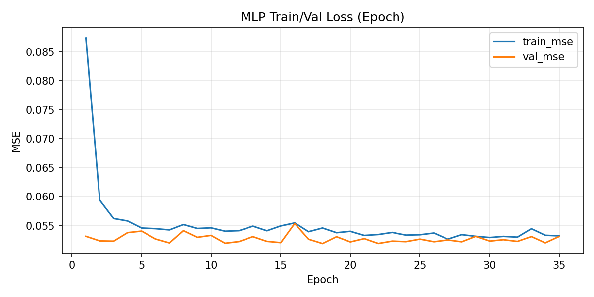
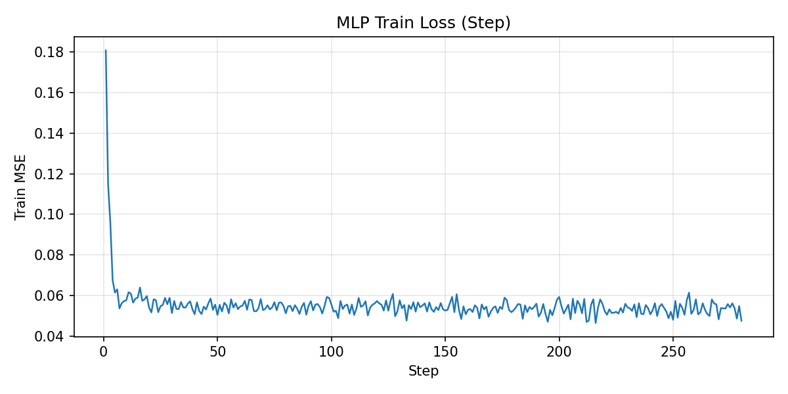
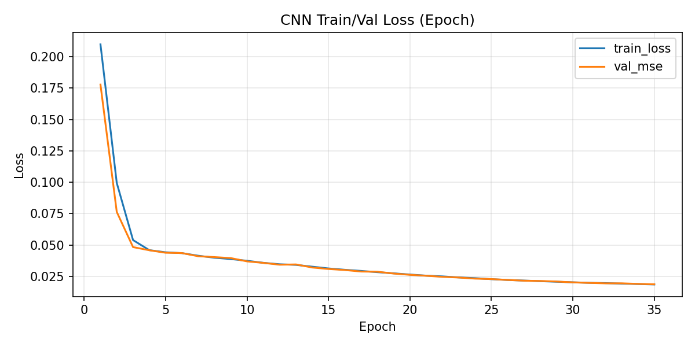
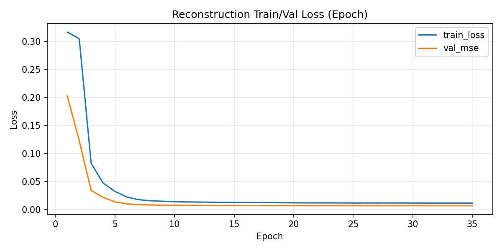
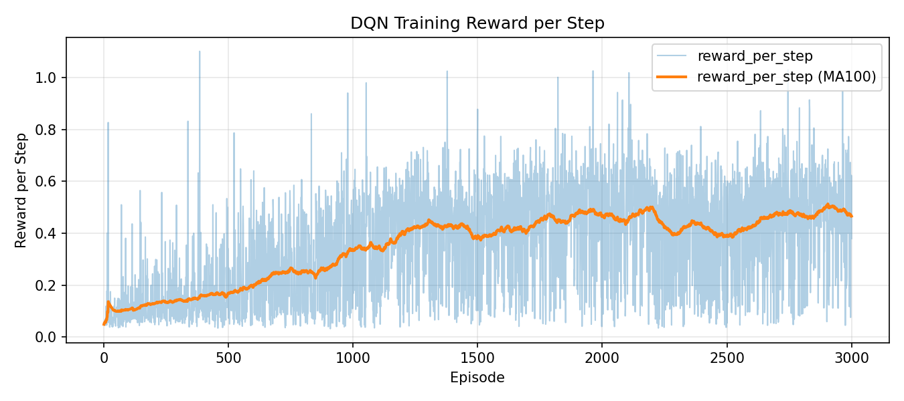
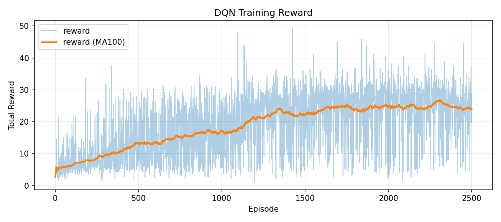
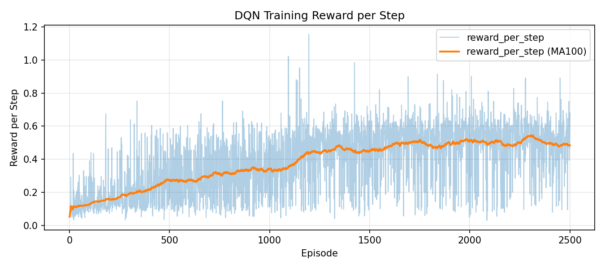
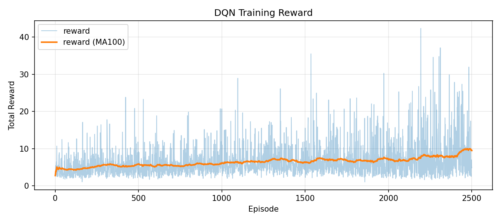
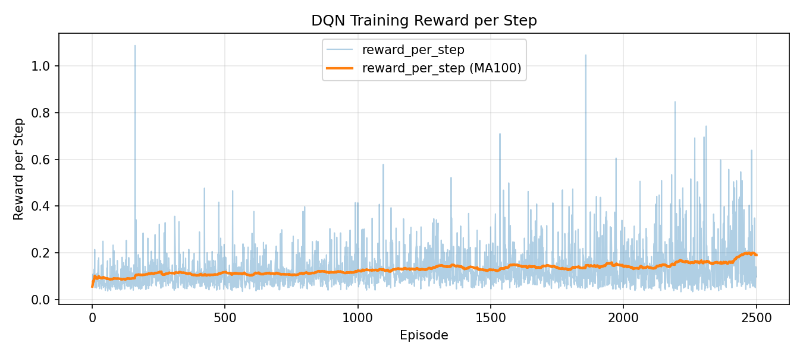

# CMPE591 - Homework 1 & Homework 2

This repository contains implementations for all HW1 deliverables:

1. Object position prediction from initial image + action with an MLP
2. Object position prediction from initial image + action with a CNN
3. Post-action image reconstruction from initial image + action

## Implementation Files

- Deliverable 1: `src/hw1_mlp_position.py`
- Deliverable 2: `src/hw1_cnn_position.py`
- Deliverable 3: `src/hw1_reconstruction.py`
- Homework 2 (DQN): `src/hw2_dqn.py`

## Data Collection

```bash
python boun_dl_robotics/cmpe591.github.io/src/hw1_mlp_position.py collect \
  --num-samples 1250 \
  --workers 1 \
  --out-dir data/hw1 \
  --seed 42
```

## Train and Test Commands

### Deliverable 1 (MLP Position)

```bash
python boun_dl_robotics/cmpe591.github.io/src/hw1_mlp_position.py train \
  --data-path data/hw1 \
  --run-dir runs/hw1/mlp_pos

python boun_dl_robotics/cmpe591.github.io/src/hw1_mlp_position.py test \
  --data-path data/hw1 \
  --checkpoint-path runs/hw1/mlp_pos/best.pt \
  --run-dir runs/hw1/mlp_pos
```

### Deliverable 2 (CNN Position)

```bash
python boun_dl_robotics/cmpe591.github.io/src/hw1_cnn_position.py train \
  --data-path data/hw1 \
  --run-dir runs/hw1/cnn_pos

python boun_dl_robotics/cmpe591.github.io/src/hw1_cnn_position.py test \
  --data-path data/hw1 \
  --checkpoint-path runs/hw1/cnn_pos/best.pt \
  --run-dir runs/hw1/cnn_pos
```

### Deliverable 3 (Image Reconstruction)

```bash
python boun_dl_robotics/cmpe591.github.io/src/hw1_reconstruction.py train \
  --data-path data/hw1 \
  --run-dir runs/hw1/reconstruction

python boun_dl_robotics/cmpe591.github.io/src/hw1_reconstruction.py test \
  --data-path data/hw1 \
  --checkpoint-path runs/hw1/reconstruction/best.pt \
  --run-dir runs/hw1/reconstruction
```

## Results Report

Reported results are read from:

- `runs/hw1/mlp_pos/test_results.json`
- `runs/hw1/cnn_pos/test_results.json`
- `runs/hw1/reconstruction/test_results.json`

### Test Errors

| Deliverable | MSE | MAE / L1 | RMSE / PSNR |
| --- | ---: | ---: | ---: |
| D1 - MLP Position | 0.0528538 | MAE: 0.1818886 | RMSE: 0.2298995 |
| D2 - CNN Position | 0.0194302 | MAE: 0.1077741 | RMSE: 0.1393923 |
| D3 - Reconstruction | 0.0064120 | L1: 0.0161466 | PSNR: 21.9301 dB |

### Loss Curves

#### D1 - MLP Position




#### D2 - CNN Position




#### D3 - Reconstruction




### Deliverable 3 Reconstruction Samples

Each sample image is formatted as:
**Before | Ground Truth | Prediction**

| Sample 0 | Sample 1 | Sample 2 | Sample 3 |
| --- | --- | --- | --- |
|  |  |  |  |

| Sample 4 | Sample 5 | Sample 6 | Sample 7 |
| --- | --- | --- | --- |
|  |  |  |  |

## Saved Checkpoints

- `runs/hw1/mlp_pos/best.pt`
- `runs/hw1/cnn_pos/best.pt`
- `runs/hw1/reconstruction/best.pt`

---

# CMPE591 - Homework 2 (DQN)

Assignment 2 implementation is provided in:

- `src/hw2_dqn.py`

The script includes separate `train()` and `test()` functions with CLI commands.
By default, training uses `high_level_state` and supports optional pixel-state training.

## HW2 Train

```bash
python boun_dl_robotics/cmpe591.github.io/src/hw2_dqn.py train \
  --state-mode high_level
```

Example run directories used in this report:

```bash
python boun_dl_robotics/cmpe591.github.io/src/hw2_dqn.py train \
  --state-mode high_level \
  --run-dir runs/hw2/dqn_1

python boun_dl_robotics/cmpe591.github.io/src/hw2_dqn.py train \
  --state-mode high_level \
  --run-dir runs/hw2/dqn_2
```

## HW2 Test

```bash
python boun_dl_robotics/cmpe591.github.io/src/hw2_dqn.py test \
  --state-mode high_level \
  --checkpoint-path runs/hw2/dqn_2/best.pt \
  --run-dir runs/hw2/dqn_2
```

## HW2 Outputs

Training artifacts:

- `runs/hw2/dqn_n/best.pt`
- `runs/hw2/dqn_n/last.pt`
- `runs/hw2/dqn_n/train_metrics.json`
- `runs/hw2/dqn_n/reward_plot.png`
- `runs/hw2/dqn_n/rps_plot.png`

Test artifact:

- `runs/hw2/dqn_n/test_results.json`

## HW2 Report Section

### Multi-Run Comparison

I trained each run in a separate folder and evaluated all of them with 100 test episodes. The comparison is broadly fair, but there is one important caveat: Run-1 was trained with `max_timesteps=30`, while Run-2 and Run-3 were trained with `max_timesteps=50`. This means Run-1 saw a shorter decision horizon during training, so its results should be interpreted with that limitation in mind.

| Run | What I changed | What happened | Interpretation |
| --- | --- | --- | --- |
| Run-1 | More aggressive setup: `n_episodes=3000`, `batch_size=256`, `gamma=0.95`, `lr=1e-3`, `tau=0.001`, fast exploration decay (`epsilon=0.4` to `0.01`), `n_warmup_episodes=50`, and `max_timesteps=30` during training. | Test (`runs/hw2/dqn_1/test_results.json`): mean reward `23.84`, mean RPS `0.4940`, success rate `5%`, mean steps `48.6`. | This run reached the highest success rate, which suggests that the more aggressive optimization helped the agent find useful behavior faster. However, the lower `gamma` and shorter training horizon likely pushed the agent toward short-term reward collection rather than reliable long-horizon planning. That explains why the average reward is good, but the success rate is still only `5%`. |
| Run-2 | More conservative setup: `n_episodes=2500`, `batch_size=128`, `gamma=0.99`, `lr=1e-4`, `tau=0.005`, `epsilon=0.9` to `0.05` (`decay=10000`), `n_replay_buffer=50000`, and `max_timesteps=50`. | Test (`runs/hw2/dqn_2/test_results.json`): mean reward `23.98`, mean RPS `0.4869`, success rate `2%`, mean steps `49.46`, and lower reward variance than Run-1 (`8.62` vs `12.15`). | Run-2 produced the best mean reward, but it did so with fewer successful episodes. This combination suggests a more stable policy that learned how to collect reward consistently, yet often failed to convert that behavior into task completion. The higher `gamma`, smaller learning rate, and larger replay buffer likely made learning smoother, but also reduced the chance of quickly locking onto the few trajectories that actually end in success. |
| Run-3 | More exploration-heavy and slower-learning setup: `n_episodes=2500`, `batch_size=128`, `gamma=0.995`, `lr=5e-5`, `tau=0.01`, `epsilon=1.0` to `0.1` (`decay=20000`), `n_replay_buffer=20000`, `n_warmup_episodes=100`, `collector_sync_updates=25`, and `max_timesteps=50`. | Test (`runs/hw2/dqn_3/test_results.json`): mean reward `7.51`, mean RPS `0.1503`, success rate `0%`, mean steps `50.0`. | Run-3 underperformed clearly. The final training epsilon stayed around `0.10`, so the agent remained relatively exploratory even near the end of training. Combined with the smaller learning rate and long exploration schedule, this likely slowed down convergence too much for a `2500`-episode budget. As a result, the policy neither accumulated dense reward efficiently nor learned goal-reaching behavior, and test episodes almost always ran until the time limit. |

Overall, the three runs are consistent with a common pattern: the agent learned to improve dense reward more easily than it learned to finish the task reliably. Run-1 favored faster adaptation and occasionally reached the goal, but its behavior was less stable. Run-2 was the most balanced in terms of average reward and variance, yet it still behaved conservatively at test time. Run-3 appears to have kept exploring for too long and did not exploit what it had learned strongly enough. For this homework, that makes Run-2 the strongest result in terms of average test performance, while Run-1 is the most interesting result in terms of actual task completion.

### Test Results

Source files: `runs/hw2/dqn_1/test_results.json`, `runs/hw2/dqn_2/test_results.json`, `runs/hw2/dqn_3/test_results.json`

| Metric | DQN-1 | DQN-2 | DQN-3 |
| --- | ---: | ---: | ---: |
| Evaluation Episodes | 100 | 100 | 100 |
| Mean Total Reward | 23.8417 | 23.9787 | 7.5141 |
| Std Total Reward | 12.1532 | 8.6171 | 4.8327 |
| Mean Reward per Step | 0.4940 | 0.4869 | 0.1503 |
| Std Reward per Step | 0.2412 | 0.1753 | 0.0967 |
| Mean Steps | 48.6 | 49.46 | 50.0 |
| Success Rate | 0.0500 (5.0%) | 0.0200 (2.0%) | 0.0000 (0.0%) |

### Reward Curves

Run-1 (`runs/hw2/dqn_1`)




Run-2 (`runs/hw2/dqn_2`)




Run-3 (`runs/hw2/dqn_3`)



