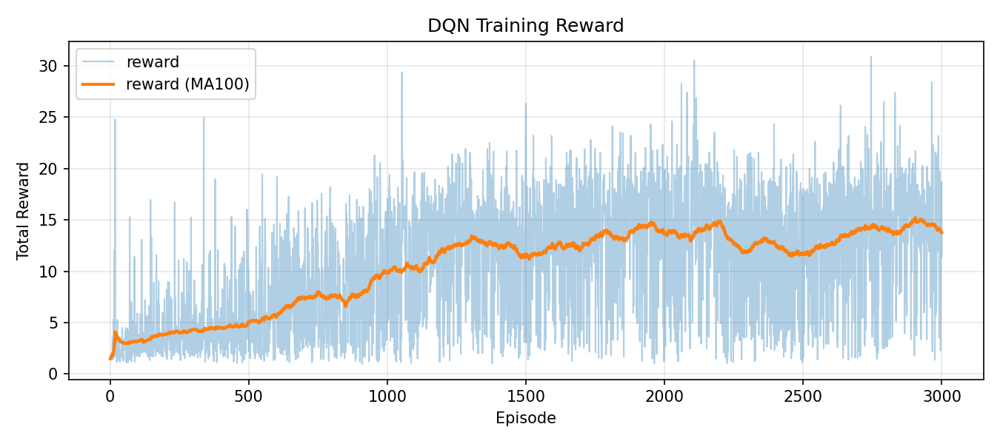

# CMPE591 - Homework 1 & Homework 2

This repository contains implementations for all HW1 deliverables:

1. Object position prediction from initial image + action with an MLP
2. Object position prediction from initial image + action with a CNN
3. Post-action image reconstruction from initial image + action

## Implementation Files

- Deliverable 1: `src/hw1_mlp_position.py`
- Deliverable 2: `src/hw1_cnn_position.py`
- Deliverable 3: `src/hw1_reconstruction.py`
- Homework 2 (DQN): `src/hw2_dqn.py`

### Direct Source Links

- [hw1_cnn_position.py](boun_dl_robotics/cmpe591.github.io/src/hw1_cnn_position.py)
- [hw1_mlp_position.py](boun_dl_robotics/cmpe591.github.io/src/hw1_mlp_position.py)
- [hw1_reconstruction.py](boun_dl_robotics/cmpe591.github.io/src/hw1_reconstruction.py)
- [hw2_dqn.py](boun_dl_robotics/cmpe591.github.io/src/hw2_dqn.py)

Each script supports `collect`, `train`, and `test` commands.

## Data Collection

```bash
python boun_dl_robotics/cmpe591.github.io/src/hw1_mlp_position.py collect \
  --num-samples 1250 \
  --workers 1 \
  --out-dir data/hw1 \
  --seed 42
```

## Train and Test Commands

### Deliverable 1 (MLP Position)

```bash
python boun_dl_robotics/cmpe591.github.io/src/hw1_mlp_position.py train \
  --data-path data/hw1 \
  --run-dir runs/hw1/mlp_pos

python boun_dl_robotics/cmpe591.github.io/src/hw1_mlp_position.py test \
  --data-path data/hw1 \
  --checkpoint-path runs/hw1/mlp_pos/best.pt \
  --run-dir runs/hw1/mlp_pos
```

### Deliverable 2 (CNN Position)

```bash
python boun_dl_robotics/cmpe591.github.io/src/hw1_cnn_position.py train \
  --data-path data/hw1 \
  --run-dir runs/hw1/cnn_pos

python boun_dl_robotics/cmpe591.github.io/src/hw1_cnn_position.py test \
  --data-path data/hw1 \
  --checkpoint-path runs/hw1/cnn_pos/best.pt \
  --run-dir runs/hw1/cnn_pos
```

### Deliverable 3 (Image Reconstruction)

```bash
python boun_dl_robotics/cmpe591.github.io/src/hw1_reconstruction.py train \
  --data-path data/hw1 \
  --run-dir runs/hw1/reconstruction

python boun_dl_robotics/cmpe591.github.io/src/hw1_reconstruction.py test \
  --data-path data/hw1 \
  --checkpoint-path runs/hw1/reconstruction/best.pt \
  --run-dir runs/hw1/reconstruction
```

## Results Report

Reported results are read from:

- `runs/hw1/mlp_pos/test_results.json`
- `runs/hw1/cnn_pos/test_results.json`
- `runs/hw1/reconstruction/test_results.json`

### Test Errors

| Deliverable | MSE | MAE / L1 | RMSE / PSNR |
| --- | ---: | ---: | ---: |
| D1 - MLP Position | 0.0528538 | MAE: 0.1818886 | RMSE: 0.2298995 |
| D2 - CNN Position | 0.0194302 | MAE: 0.1077741 | RMSE: 0.1393923 |
| D3 - Reconstruction | 0.0064120 | L1: 0.0161466 | PSNR: 21.9301 dB |

### Loss Curves

#### D1 - MLP Position


#### D2 - CNN Position


#### D3 - Reconstruction


### Deliverable 3 Reconstruction Samples

Each sample image is formatted as:
**Before | Ground Truth | Prediction**

| Sample 0 | Sample 1 | Sample 2 | Sample 3 |
| --- | --- | --- | --- |
|  |  |  |  |

| Sample 4 | Sample 5 | Sample 6 | Sample 7 |
| --- | --- | --- | --- |
|  |  |  |  |

## Saved Checkpoints

- `runs/hw1/mlp_pos/best.pt`
- `runs/hw1/cnn_pos/best.pt`
- `runs/hw1/reconstruction/best.pt`

---

# CMPE591 - Homework 2 (DQN)

Assignment 2 implementation is provided in:

- `src/hw2_dqn.py`

The script includes separate `train()` and `test()` functions with CLI commands.
By default, training uses `high_level_state` (as requested in the assignment) and supports optional pixel-state training.

## HW2 Setup

```bash
source robotics_env/bin/activate
```

## HW2 Train

```bash
python boun_dl_robotics/cmpe591.github.io/src/hw2_dqn.py train \
  --state-mode high_level \
  --run-dir runs/hw2/dqn
```

## HW2 Test

```bash
python boun_dl_robotics/cmpe591.github.io/src/hw2_dqn.py test \
  --state-mode high_level \
  --checkpoint-path runs/hw2/dqn/best.pt \
  --run-dir runs/hw2/dqn
```

## HW2 Outputs

Training artifacts:

- `runs/hw2/dqn/best.pt`
- `runs/hw2/dqn/last.pt`
- `runs/hw2/dqn/train_metrics.json`
- `runs/hw2/dqn/reward_plot.png`
- `runs/hw2/dqn/rps_plot.png`

Test artifact:

- `runs/hw2/dqn/test_results.json`

## HW2 Report Section

### Instructor Update (Implemented as Defaults)

The default state-based hyperparameters in `src/hw2_dqn.py` are now:

| Hyperparameter | Value |
| --- | ---: |
| memory_size (`n_replay_buffer`) | 10000 |
| num_episodes (`n_episodes`) | 2500 |
| batch_size | 128 |
| eps_decay | 10000 |
| eps_end (`epsilon_min`) | 0.05 |
| eps_start (`epsilon`) | 0.9 |
| gamma | 0.99 |
| learning_rate (`lr`) | 0.0001 |
| tau (soft target update) | 0.005 |

### Recommended Train Command (Updated Defaults)

```bash
python boun_dl_robotics/cmpe591.github.io/src/hw2_dqn.py train \
  --state-mode high_level \
  --render-mode offscreen \
  --run-dir runs/hw2/dqn
```

### Baseline Result (Before This Update)

This baseline is from the previous run file:
- `runs/hw2/dqn/train_metrics.json`

| Metric | Value |
| --- | ---: |
| Episodes | 3000 |
| Best Reward | 30.8804 |
| Final Epsilon | 0.0209 |
| Total Updates | 121864 |
| Reward Mean (all episodes) | 10.6222 |
| Reward/Step Mean (all episodes) | 0.3579 |
| Reward Mean (last 50 episodes) | 13.9764 |
| Reward/Step Mean (last 50 episodes) | 0.4789 |
| Reward Mean (last 100 episodes) | 13.7801 |
| Reward/Step Mean (last 100 episodes) | 0.4659 |
| Reward Mean (last 200 episodes) | 14.4158 |
| Reward/Step Mean (last 200 episodes) | 0.4866 |

### Multi-Run Comparison Table (Required by Instructor)

Run each experiment with a different `--run-dir` (for example `runs/hw2/dqn_run1`, `runs/hw2/dqn_run2`, ...), then fill this table:

| Run | 1) What changed in hyperparameters? | 2) Effect on performance | 3) Brief discussion (why?) |
| --- | --- | --- | --- |
| Run-1 | Updated default set above | Fill from `train_metrics.json` and `test_results.json` |  |
| Run-2 |  |  |  |
| Run-3 |  |  |  |

### Test Results

- Add per-run test summaries from each run directory:
- mean reward
- reward per step
- success rate

### Reward Curves



