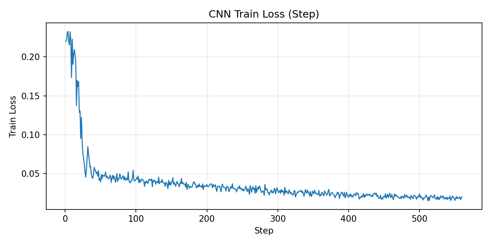
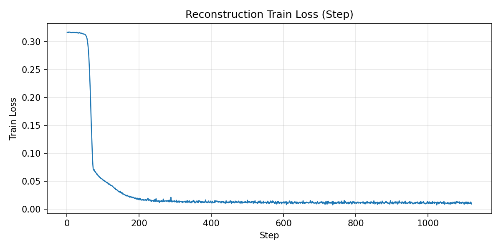
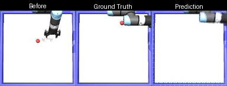
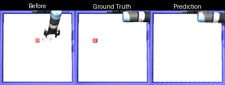
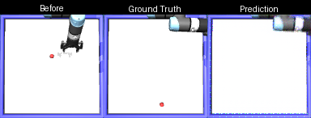
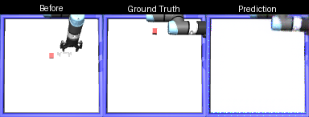

# CMPE591 - Homework 1

This repository contains implementations for all HW1 deliverables:

1. Object position prediction from initial image + action with an MLP
2. Object position prediction from initial image + action with a CNN
3. Post-action image reconstruction from initial image + action

## Implementation Files

- Deliverable 1: `src/hw1_mlp_position.py`
- Deliverable 2: `src/hw1_cnn_position.py`
- Deliverable 3: `src/hw1_reconstruction.py`

Each script supports `collect`, `train`, and `test` commands.

## Setup

```bash
source robotic_env/bin/activate
```

## Data Collection

```bash
python boun_dl_robotics/cmpe591.github.io/src/hw1_mlp_position.py collect \
  --num-samples 1250 \
  --workers 1 \
  --out-dir data/hw1 \
  --seed 42
```

## Train and Test Commands

### Deliverable 1 (MLP Position)

```bash
python boun_dl_robotics/cmpe591.github.io/src/hw1_mlp_position.py train \
  --data-path data/hw1 \
  --run-dir runs/hw1/mlp_pos

python boun_dl_robotics/cmpe591.github.io/src/hw1_mlp_position.py test \
  --data-path data/hw1 \
  --checkpoint-path runs/hw1/mlp_pos/best.pt \
  --run-dir runs/hw1/mlp_pos
```

### Deliverable 2 (CNN Position)

```bash
python boun_dl_robotics/cmpe591.github.io/src/hw1_cnn_position.py train \
  --data-path data/hw1 \
  --run-dir runs/hw1/cnn_pos

python boun_dl_robotics/cmpe591.github.io/src/hw1_cnn_position.py test \
  --data-path data/hw1 \
  --checkpoint-path runs/hw1/cnn_pos/best.pt \
  --run-dir runs/hw1/cnn_pos
```

### Deliverable 3 (Image Reconstruction)

```bash
python boun_dl_robotics/cmpe591.github.io/src/hw1_reconstruction.py train \
  --data-path data/hw1 \
  --run-dir runs/hw1/reconstruction

python boun_dl_robotics/cmpe591.github.io/src/hw1_reconstruction.py test \
  --data-path data/hw1 \
  --checkpoint-path runs/hw1/reconstruction/best.pt \
  --run-dir runs/hw1/reconstruction
```

## Results Report

Reported results are read from:

- `runs/hw1/mlp_pos/test_results.json`
- `runs/hw1/cnn_pos/test_results.json`
- `runs/hw1/reconstruction/test_results.json`

### Test Errors

| Deliverable | MSE | MAE / L1 | RMSE / PSNR |
| --- | ---: | ---: | ---: |
| D1 - MLP Position | 0.0528538 | MAE: 0.1818886 | RMSE: 0.2298995 |
| D2 - CNN Position | 0.0194302 | MAE: 0.1077741 | RMSE: 0.1393923 |
| D3 - Reconstruction | 0.0064120 | L1: 0.0161466 | PSNR: 21.9301 dB |

### Loss Curves

#### D1 - MLP Position


#### D2 - CNN Position




#### D3 - Reconstruction




### Deliverable 3 Reconstruction Samples

Each sample image is formatted as:
**Before | Ground Truth | Prediction**

| Sample 0 | Sample 1 | Sample 2 | Sample 3 |
| --- | --- | --- | --- |
|  |  |  |  |

| Sample 4 | Sample 5 | Sample 6 | Sample 7 |
| --- | --- | --- | --- |
|  |  |  |  |

## Saved Checkpoints

- `runs/hw1/mlp_pos/best.pt`
- `runs/hw1/cnn_pos/best.pt`
- `runs/hw1/reconstruction/best.pt`
